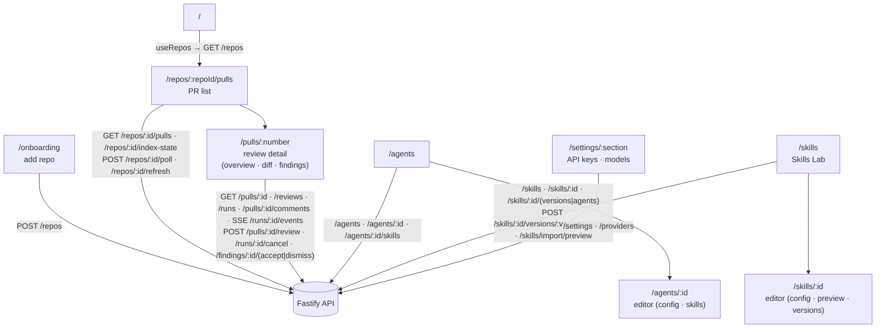

# `@devdigest/web` — the studio (Next.js 15)

The DevDigest UI: import repos, browse pull requests, run and read AI reviews,
and author agents. App Router + React Server/Client components, data via
**TanStack Query** hooks over the Fastify API. (This is the starter surface;
course lessons add the Skills, Memory, Eval, Blast/Brief, multi-agent, CI, and
dashboard screens.)

- **Stack:** Next.js 15 (App Router), React 19, TanStack Query, `next-intl`
  (messages in `messages/<locale>/*.json`), `recharts`, `mermaid`,
  `react-markdown`. UI primitives are vendored under `src/vendor/ui`
  (`@devdigest/ui`) and shared Zod contracts under `src/vendor/shared`
  (`@devdigest/shared`).
- **API base:** `NEXT_PUBLIC_API_BASE` (default `http://localhost:3001`), used by
  `src/lib/api.ts`. Every data hook lives in `src/lib/hooks/*`.
- **Run:** `pnpm dev` (`:3000`). **Test:** `pnpm test` (vitest + jsdom, hooks or
  `src/lib/api.ts` mocked — no API needed). **Typecheck:** `pnpm typecheck`.

## UI route map

Routes (`src/app/**/page.tsx`; all but `/onboarding` sit in the `src/app/(shell)/`
route group, which adds nothing to the URL) and the API surface each leans on (via
`src/lib/hooks/*` → `src/lib/api.ts`):

Cross-cutting chrome lives in `src/components/app-shell` (nav, breadcrumbs,
`g`-then-key shortcuts), mounted once by `src/app/(shell)/layout.tsx`; a page sets
its breadcrumb with `useShellCrumb`. Pages are thin server files (tab title via
`generateMetadata`) that render one client `<Name>View`; feature logic sits in
colocated `_components/<Name>/` folders, each with its own `*.test.tsx`.

## Testing

Component/interaction tests (`*.test.tsx`) run under vitest + jsdom with the hook
modules mocked (`vi.mock("@/lib/hooks/…")`); the data-layer tests mock `src/lib/api.ts`
instead. Neither needs the API or a browser. The real browser journeys
(client + API + seeded DB) are covered by the deterministic agent-browser suite
in [`../e2e`](../e2e/README.md) and the `e2e-web.yml` workflow. See
[`../TESTING.md`](../TESTING.md).
