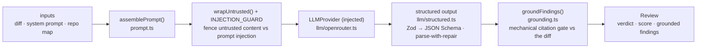

# `@devdigest/reviewer-core` — the review engine

Pure review logic: **diff → prompt → LLM → grounded findings**. No database,
GitHub, or filesystem; the only side effect is an LLM call through an **injected**
`LLMProvider`, which is what makes it mock-testable.

In the starter the **server** (`@devdigest/api`) is its only consumer — for local
reviews in the studio. (The CI runner that runs the same engine in GitHub Actions
is added back in the Export-to-CI lesson, L06.) The server wires it via a tsconfig
path alias (`@devdigest/reviewer-core` → `../reviewer-core/src`) and consumes the
TypeScript **source** directly (tsx in dev, vitest in tests). The package never
emits JS — its `build` is a type-check.

## Pipeline

The grounding step is the mandatory gate: a finding that doesn't cite a real line
in the diff is dropped, so the engine can't hallucinate locations. The score and
the verdict are recomputed deterministically from the **surviving** findings (the
verdict under the agent's `failOn` gate), not trusted from the model. `review/run.ts`
orchestrates the run (single-pass by default).

The engine also accepts optional prompt slots the **course lessons** start
feeding it — `skills` (L02), `memory` (L07), `specs` (L05) — plus a map-reduce
path (`reduceReviews` / `sliceDiff`) and a `toReviewPayload()` CI payload helper
used from L06. The server passes the diff, system prompt, task, PR title and author,
and, when it has them, the repo map, the callers digest, the agent's enabled skills (L02,
each rendered as its own `### <name>` block under `## Skills / rules`) and the PR description
(`../server/src/modules/reviews/run-executor.ts:204-233`); `memory` and `specs` are still
omitted, so `assemblePrompt` simply leaves those sections out.

## Public API

Exported from `src/index.ts`: `assemblePrompt` / `wrapUntrusted` / `renderSkill` /
`skillBlocks` / `estimateTokens` and the `PromptSkill` type (prompt),
`groundFindings` / `groundingSummary` (grounding), `toJsonSchema` / `extractJson`
/ `parseWithRepair` (structured output), the `reviewPullRequest` entrypoint,
`reduceReviews` / `sliceDiff` (map-reduce), `toReviewPayload` / `gateTriggered` /
`countBlockers` / `verdictFromFindings` (output) and the billed-failure errors
(`LlmCallError`, `DiffTooLargeError`, `NothingToReviewError`, `usageOf`).
Contracts (`Review`, `Finding`, `Verdict`, …) come from
`@devdigest/shared`. `OpenRouterProvider` is not exported there, so importing the engine
never pulls in an HTTP client: the server's container imports it from the
`@devdigest/reviewer-core/llm/openrouter.js` subpath (`src/index.ts:73-75`).

## Testing

`npm test` (vitest) — hermetic units with a stubbed `LLMProvider`: prompt
assembly and `wrapUntrusted`, the grounding gate, `toReviewPayload` and the CI gate,
map-reduce, the run limits, `OpenRouterProvider` against a fake `fetch`, and a full
`reviewPullRequest`. No keys, no network. `npm run typecheck` doubles as the build. See
[`../TESTING.md`](../TESTING.md).
