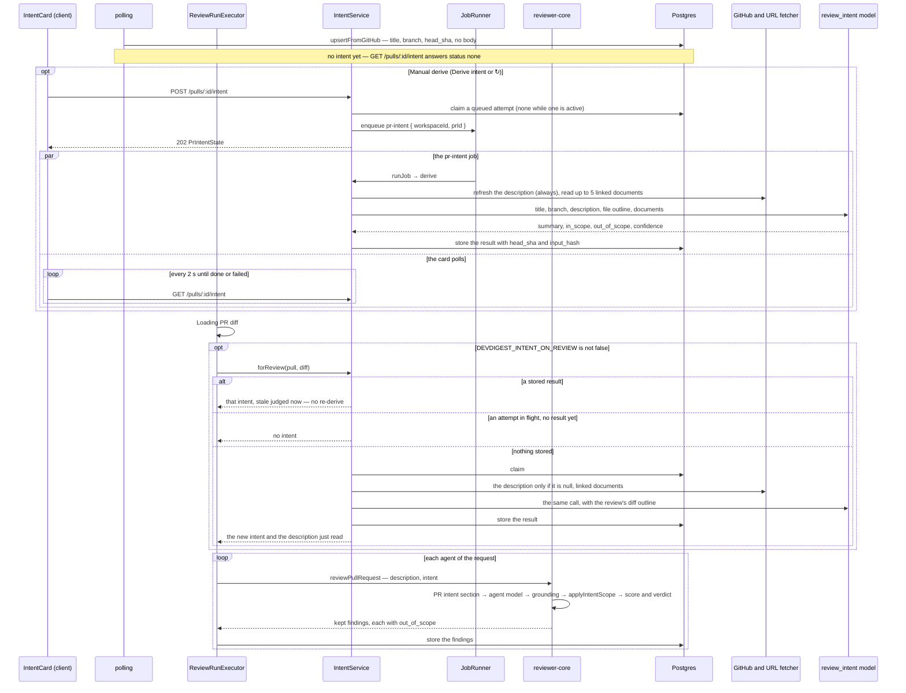

# Intent Layer

**Status:** shipped

## Problem

The reviewer used to see a PR's title, description (cut to 4000 characters) and diff, and nothing
about what the PR is for. It commented on code that has nothing to do with the task, and the author
had no way to check how the system read the task.

Goal (lesson L03): a separate, cheap model call derives the PR's **intent** —
`{ summary, in_scope[], out_of_scope[] }` plus a confidence, the sources it used and the
documents it could not read. The result is stored per PR and shown as a card on the PR's Overview
tab. It then goes into the reviewer's prompt, and plain code in `reviewer-core` drops the findings
the model flagged as outside it. The model only flags; code decides what leaves the review.

A PR with no description or links is a normal case, not an error: the intent is read from the
title, the branch name and the outline of the changed files, with confidence `low`.

## Scope

- **Server, new module** `src/modules/intent/` (onion layout):
  - `domain.ts`: the LLM schema `IntentClassification`; `normalizeIntentInput`, `intentFreshness`,
    `extractReferences`, `addedFileText`, `fileOutline`, `confidenceCap`, `finalizeIntent`.
  - `prompt.ts` (the classifier prompt), `ports.ts`, `service.ts`, `repository.ts`, `routes.ts`,
    `helpers.ts` (row → DTO, failure → reason code), `constants.ts` (caps, timeouts, rate limit).
  - Registered in `src/modules/index.ts:10,37`.
- **Server, changed:**
  - `src/platform/container.ts:180-203,366-372`: the getters `intentRepo`, `intentService` and
    `intentUrlFetcher`. The service is built here, from ports, and handed to both the intent routes
    and the reviews routes (`src/modules/intent/routes.ts:21`, `src/modules/reviews/routes.ts:32`).
  - `src/modules/reviews/{ports,domain,run-executor,routes,helpers}.ts` and
    `src/modules/reviews/repository/review.repo.ts`: the `IntentProvider` port, the pre-work step,
    `out_of_scope` on findings. The pre-staged, caller-less `upsertIntent` / `getIntent` are gone
    from `src/modules/reviews/repository.ts` and `.../repository/pull.repo.ts`; the intent module
    owns `pr_intent`.
  - `src/platform/config.ts:49-51,84-85,115`: `intentOnReview` from `DEVDIGEST_INTENT_ON_REVIEW`.
  - `src/adapters/github/octokit.ts:481-502` and `src/adapters/mocks.ts:264-272`:
    `GitHubClient.getFileText` (`src/vendor/shared/adapters.ts:198-199`).
  - `src/adapters/http/safe-fetch.ts:195-196,209-217`: `SafeFetchOptions.userAgent`; the default
    stays `DevDigest-SkillImport/1.0`.
  - `src/adapters/llm/fake.ts:20-27,81-96`: the fake LLM answers the intent schema too.
  - `src/db/seed.ts:425,653-692`: a seeded intent for PR #482.
- **Tables:** migration `src/db/migrations/0018_uneven_dagger.sql`, generated, no DROP.
  - `pr_intent` (`src/db/schema/reviews.ts:86-122`) keeps its column `intent` (now the summary,
    nullable: `DROP NOT NULL`, `0018_uneven_dagger.sql:1`) and gains `workspace_id` (FK, cascade),
    `status` (`queued | running | done | failed`, default `done`, CHECK `pr_intent_status_ck`),
    `error`, `job_id` (no FK), `confidence` (CHECK `pr_intent_confidence_ck`), `sources` and
    `missing_context` (jsonb), `head_sha`, `input_hash`, `provider`, `model`, `tokens_in`,
    `tokens_out`, `cost_usd` (`numeric`), `requested_at`, `finished_at`, `derived_at`.
  - `findings.out_of_scope boolean not null default false`
    (`src/db/schema/reviews.ts:69-70`, `0018_uneven_dagger.sql:2`).
  - One row per PR. The result columns (`intent` … `derived_at`) belong to the last **successful**
    derive; `status`, `error`, `job_id`, the model, usage, `requested_at` and `finished_at` belong
    to the latest **attempt** (`src/db/schema/reviews.ts:81-85`). A failed re-derive keeps the last result.
- **Contracts** (`src/vendor/shared/contracts/`, mirrored byte-for-byte in
  `../../client/src/vendor/shared/`):
  - `brief.ts`: `Intent.intent` is now `summary`; new `IntentConfidence`, `IntentSourceKind`,
    `IntentSourceStatus`, `IntentSource`, `ReviewIntentContext`.
  - `review-api.ts`: `PrIntentRecord` gains confidence, sources, `missing_context`, `head_sha`,
    `derived_at`; new `PrIntentStatus`, `PrIntentStaleReason`, `PrIntentState`.
  - `findings.ts:62-67`: `Finding.out_of_scope` (nullish, so it stays valid in a strict
    `json_schema`); `trace.ts:67-68`: `PromptAssembly.intent`.
  - `platform.ts`: the `review_intent` feature model defaults to `openrouter` / `openai/gpt-5.4-nano`.
- **reviewer-core:** the `## PR intent` section and the out-of-scope filter. See
  [`../../reviewer-core/specs/grounding-and-scoring.md`](../../reviewer-core/specs/grounding-and-scoring.md)
  (rules X1–X3) and [`../../docs/agent-prompts/README.md`](../../docs/agent-prompts/README.md).
- **Client:** see [`client/specs/06-intent-layer.md`](../../client/specs/06-intent-layer.md).

**Unchanged (no diff at all):**
- `server/src/modules/repo-intel/**`, `server/src/modules/conventions/**`,
  `server/src/modules/skills/**`, `server/src/modules/agents/**`, `server/src/modules/pulls/**`,
  `server/src/modules/polling/**`, `server/src/modules/repos/**`, `server/src/modules/settings/**`,
  `server/src/modules/workspace/**`;
- `server/src/modules/reviews/service.ts`, `server/src/modules/reviews/constants.ts`,
  `server/src/modules/reviews/repository/run.repo.ts`;
- `server/src/platform/jobs.ts`, `server/src/app.ts`;
- `server/src/adapters/git/diff-parser.ts`: the outline is built from `diff.raw`, the parser is not touched;
- `reviewer-core/src/llm/openrouter.ts`: no `provider.require_parameters`, no `reasoning`;
- `client/src/app/(shell)/repos/[repoId]/pulls/[number]/_components/RunTraceDrawer/_components/TraceBody/TraceBody.tsx`:
  the drawer does not render the `intent` slot of the prompt assembly;
- `e2e/**`.

**Out of scope:**
- Risk areas, blast radius, the PR brief card, review focus and Smart Diff (L04–L05);
- Jira and Linear: a ticket key is listed as unavailable and nothing is requested;
- an automatic re-derive when the head moves or the description changes;
- the intent's cost in `agent_runs.cost_usd` or in the PR list's COST: it is only in `pr_intent.cost_usd`.

## API / Data

**Routes** — `src/modules/intent/routes.ts`

| Method | Path | Body → reply | Errors |
| ------ | ---- | ------------ | ------ |
| GET | `/pulls/:id/intent` (`:34`) | → `PrIntentState`; `status: 'none'` and `intent: null` before the first derive. No rate limit (the UI polls it every 2 s) | 404 `not_found` · 422 (`:id` not a uuid) |
| POST | `/pulls/:id/intent` (`:45`) | no body → **202** `PrIntentState`: queues an attempt and its job, or — when the PR already has a `queued`/`running` attempt — returns the state unchanged (no new attempt, no error); rate limit 5/min (`constants.ts:40`) | 404 · 422 · 503 `shutting_down` |

Every `IntentStore` method but the boot reaper filters by `workspace_id`
(`src/modules/intent/repository.ts:15-16`), and the PR is looked up with `pullInWorkspace`
(`service.ts:450-454`): another workspace's PR is a 404.

`PrIntentState` (`src/vendor/shared/contracts/review-api.ts`): `pr_id`, `status`
(`none | queued | running | done | failed`), `error`, `stale`, `stale_reason`
(`head_changed | description_changed`), `intent` (the last successful `PrIntentRecord`, kept across
a failed attempt), `provider`, `model`, `tokens_in`, `tokens_out`, `cost_usd`, `requested_at`,
`finished_at`. `error` is the failed attempt's message (`helpers.ts:7-44`, `service.ts:250`).

### Flow: from import to review

- Importing a PR derives nothing. The poll stores each PR with `upsertFromGitHub`
  (`src/modules/polling/service.ts:29`, `src/modules/pulls/repository.ts:179-219`), and the list
  payload carries no description. The body is written only when the PR's detail is fetched: on
  `GET /pulls/:id` (`src/modules/pulls/service.ts:40-52`) or by a derive's refresh
  (`service.ts:358-374`). A PR nobody has opened therefore reaches pre-work with `body: null`,
  the one case where pre-work refreshes it (`service.ts:261`).
- A failure anywhere in pre-work only drops the intent: the review goes on without it
  (`service.ts:193-196`, `src/modules/reviews/run-executor.ts:117-120`).

### Sources and limits

A derive reads three inputs every time, then every document the PR links
(`service.ts:274-286`):

| Source | Read from | Limit |
| ------ | --------- | ----- |
| `title` | the stored title, plus the branch name in the same `pr-meta` block (`prompt.ts:53`) | 256 characters (`domain.ts:131`) |
| `description` | the stored body, after a refresh from GitHub; empty → `skipped` with reason `empty` (`service.ts:278-280`) | 4000 characters (`domain.ts:132`) |
| `files` | `fileOutline` over the PR's diff: per file the path and `+added -deleted`, then its `@@ … @@ context` hunk headers; never a body line (`domain.ts:402-460`) | 200 files, 20 hunks a file, 8000 characters, a header cut at 200 (`domain.ts:392-395`); beyond that the source is `truncated` |

The diff comes from the review run when the derive is pre-work, else from the diff source
(`service.ts:267`).

Links are found in the title, the description and — for ticket keys only — the branch name, in
that order (`extractReferences`, `domain.ts:336-361`). Nothing there touches the network.

| Pattern | Kind | Read with | When it cannot be read |
| ------- | ---- | --------- | ---------------------- |
| `#N`, `owner/repo#N`, a github.com `issues/N` or `pull/N` URL | `issue` / `pull` | `GitHubClient.getIssue` (`service.ts:421-424`) | `unavailable` (`not_found`, `forbidden`, `timeout`, `error`) |
| a github.com `blob` URL of **this** repo, or a bare path ending `.md .mdx .txt .rst .adoc` | `repo_file` | the diff, when the PR adds the file whole (`addedFileText`, `domain.ts:367-388`); else `getFileText` at the PR's head sha (`service.ts:425-431`) | `unavailable` |
| a `blob` URL of another repo | `repo_file` | — | `skipped`: `other_repo` |
| an `https://` URL whose path ends `.md .markdown .txt` | `url` | the SSRF-safe `UrlFetcher` (`service.ts:432-436`) | `unavailable` (`blocked`, `too_large`, `unsupported_type`, `timeout`, `not_found`, `forbidden`, `error`; `helpers.ts:72-91`) |
| any other `https://` URL; `http://` | `url` | — | `skipped`: `unsupported_type` / `insecure` |
| `[A-Z][A-Z0-9]{1,9}-\d+` except `SHA UTF ISO RFC CVE HTTP TLS AES UTC`; `*.atlassian.net` and `linear.app` URLs | `ticket` | — (no integration, no request) | `unavailable`: `no_integration` |

- A link seen twice counts once; at most 20 distinct links are kept (`domain.ts:189`), and only the
  first 5 that can be fetched are (`domain.ts:187`) — later ones are `skipped` with reason `limit`.
- A document is cut to 6000 characters and all documents together to 24000: the cut one is
  `truncated`, one past the total budget is `skipped` with `limit` (`constants.ts:27-29`,
  `service.ts:384-400`). A URL body is read up to 256 KiB (`constants.ts:31`).
- A `ref` never holds a query, fragment, port or credentials: a URL is `host/path`
  (`domain.ts:221`), an issue `#12` or `owner/repo#12` (`domain.ts:223-225`). The fetch itself may
  keep the query (signed links) but drops credentials and the fragment (`domain.ts:273-278`).
- A `reason` is a code from the lists above, never an error's text (`helpers.ts:63-91`).
- Each read has 15 s (`constants.ts:23`); the description refresh has 15 s
  (`constants.ts:22`, `service.ts:364-367`) and is best effort: without a GitHub token, or on an
  error, the derive goes on with the stored description (`service.ts:358-374`).
  A manual derive always refreshes; pre-work refreshes only a PR whose body is `null`
  (`service.ts:261`).
- Every linked document reaches the model in its own `<untrusted>` block, the unreadable ones as
  a list in a last block (`prompt.ts:64-75`).
- Plans and specs count only as links. A path such as `docs/plans/….md` or `server/specs/….md`, or
  a blob URL of this repo, in the title or description is a `repo_file`: read from the diff when the
  PR adds it whole, else at the PR's head sha — the version on the PR's branch, not the base
  (`service.ts:425-431`). A plan the PR adds without linking it shows up only in the outline, as a
  path with `+N -0`; its text is never read. The classifier is told to base the scope on linked
  documents first (`prompt.ts:27`).

### Confidence

The model answers `{ summary, in_scope, out_of_scope, confidence, missing_context }`
(`domain.ts:112-126`). The code decides the final confidence: `min(cap, model's)` — the model can
only lower it (`finalizeIntent`, `domain.ts:518`). The cap (`confidenceCap`, `domain.ts:474-485`):

- `linked_used` = a source of kind `issue`, `pull`, `repo_file` or `url` with status `used` or `truncated`;
- `linked_missing` = a link source (any kind but title, description and files) with status
  `unavailable` or `skipped`;
- `low` when the description is empty (`skipped` / `empty`) and `linked_used` is false;
- otherwise `medium` when `linked_missing` is true or `linked_used` is false;
- otherwise `high`.

| What the PR has | Confidence | Source `description` | `missing_context` |
| --------------- | ---------- | -------------------- | ----------------- |
| no description, no links | `low` | `skipped` / `empty` | `[]` |
| a description, no links | `medium` | `used` | `[]` |
| no description, a link that was read | up to `high` | `skipped` / `empty` | |
| a description, every link read | `high` | `used` | `[]` |
| a description, some link unavailable or skipped | `medium` | `used` | `["#999: not_found"]` for each unavailable one |

An empty description never fails a derive and never blocks it: the intent is still derived, from the
title, branch and outline. `missing_context` is built by code from the `unavailable` sources
(`<ref>: <reason>`); the model's own list is not used (`domain.ts:519`). The summary is cut to 500
characters and each list to 8 items of 200 (`domain.ts:487-495`). The classifier prompt says so:
for an empty description it must still infer the intent, never answer "unknown", never refuse and
set `low`; it must not invent what an unavailable document said (`prompt.ts:24-31`).

### Triggers

An attempt starts in one of two ways. There is no other.

1. **Manual** — `POST /pulls/:id/intent` (the card's Derive intent and ↻).
   - `requestDerive` (`service.ts:97-114`) checks the PR, resolves the `review_intent` model
     (Settings → Models, else the registry default, `container.ts:206-207`), then `claim` writes a
     `queued` attempt with one upsert that updates nothing while an attempt is `queued`/`running`
     (`repository.ts:37-62`). Without a row back, the active attempt is returned as it is.
   - Then a `pr-intent` job is enqueued with payload `{ workspaceId, prId }` and the job id is stored.
     The payload has no `repoId`, so the JobRunner does not serialise intents per repo. If enqueueing
     throws (503), the attempt is marked `failed` and the error is rethrown (`service.ts:104-111`).
   - The job (`runJob`, `service.ts:131-140`) marks the attempt `running` and calls `derive`: refresh
     the description → read the diff → find links → read them in parallel → build the prompt →
     one `completeStructured` call → `finalizeIntent` → store. A job whose row is gone or no longer
     active is a no-op.
   - The model call has `maxTokens` 8000 (a picked model may reason, and hidden reasoning counts
     against the cap), one retry and a 60 s abort (`constants.ts:14-15,24`); the whole derive stays
     under the JobRunner's 120 s job timeout (`constants.ts:17-24`).
   - `runJob` **never throws** once the attempt is running: every failure (a missing key, a model
     error, a timeout) is written to the row as `failed` with `error` and the tokens and cost the
     call billed (`service.ts:247-255`). A thrown 5xx would be retried twice, paying three times.
     Only a malformed payload throws, a 422 (`service.ts:133-135`).
2. **Review pre-work** — `ReviewRunExecutor` runs a step "Preparing PR intent" after the diff is
   loaded and before the first agent, when `intentOnReview` is true
   (`src/modules/reviews/run-executor.ts:114-121`). It calls `forReview` (`service.ts:154-197`):
   - a stored result is used as it is, with `stale` set by the rule below;
   - no result and no active attempt: claim, then derive **inline** (no job, the review already holds
     its queue slot), with the review's diff, and store the result;
   - an attempt in flight with no result: the review goes without an intent;
   - any failure: no intent, a warning, and the review goes on. A review never depends on its intent.
   - It also returns the description to review with: the one just read from GitHub for a PR that had
     none (`run-executor.ts:244`). One intent is shared by all agents of the request.
   - `DEVDIGEST_INTENT_ON_REVIEW` (default on; any value but `false` keeps it on,
     `config.ts:115`). `server/vitest.config.ts:28-29` sets it to `false`, because the reviews tests
     count model calls; the intent tests turn it on themselves.

**Interrupted attempts.** Jobs live in the process's memory. When the intent plugin registers (boot),
every `queued`/`running` attempt of every workspace is marked `failed` with "The API restarted while
this intent was being derived", like the JobRunner's own boot reaper; a reaper failure is logged, not
fatal (`src/modules/intent/routes.ts:26-32`, `service.ts:143-145`, `repository.ts:101-108`,
`constants.ts:37`). The last result of that row stays.

### Staleness

`stale` is judged on every read against the PR as it is now (`intentFreshness`, `domain.ts:151-161`;
`service.ts:441-448`), never stored:

- `head_changed` when the stored `head_sha` differs from the PR's head sha;
- else `description_changed` when the stored `input_hash` differs from the sha256 of the
  normalised title and body (`normalizeIntentInput`, `domain.ts:139-145`; `inputHashOf`,
  `service.ts:488-491`);
- a `null` `input_hash` (the seeded row) is not compared; a PR without a result is never stale.

A stale intent is not re-derived by itself. In a review it still goes into the prompt, marked as
possibly outdated, and the engine only **tags** findings with it (it drops none); the card shows a
banner and ↻. A new derive replaces it.

### Out-of-scope filter

The reviewer model sets `out_of_scope: true` on a finding about code outside the intent. The engine
then decides, between grounding and the score and verdict (`reviewer-core/src/scope.ts:24-56`):

- no intent → nothing dropped, a stray flag is reset;
- the intent is stale or `low` → **tag-only**: flags stay, nothing is dropped;
- otherwise → **filter**: an out-of-scope WARNING or SUGGESTION is dropped, with a reason; of the
  out-of-scope CRITICALs the one with the highest confidence stays (the first on a tie) and the rest
  are dropped. The kept one counts in the verdict, the score and the gate.

The findings table keeps the flag (`review.repo.ts:54`), and `GET /pulls/:id/reviews` returns it
(`src/modules/reviews/helpers.ts:37`). Dropped findings are not stored. Rules, tests and the prompt
section: [`grounding-and-scoring.md`](../../reviewer-core/specs/grounding-and-scoring.md).

### Logging

A derive writes **one** line per classification, `info`, or `warn` when it failed
(`service.ts:218-240`), message `intent: classified`:
`prId`, `trigger` (`manual` or `review`), `provider`, `model`, `prompt_parts` (name and token
estimate of each part), `tokens_est`, `sources` (`kind`, `ref`, `status`, `reason`, `chars` of each),
`files`, `hunks`, `tokens_in`, `tokens_out`, `cost_usd`, `duration_ms`, `confidence`, `capped`,
`outcome` (`done`, `discarded` or `failed`) and, on failure, `error`.

It never writes: the description, a linked document's text, a diff or hunk line, the model's output
or the intent's text, a URL's query or fragment, the text of a fetch, GitHub or model error,
a key or a token. What stands in for them:
- `ref` is already sanitised, a `reason` is a code (`helpers.ts:63-91`), and `error` in the log is
  the error's code or class name (`service.ts:494-496`), not its message;
- the other warnings carry only `prId` and that code (`service.ts:194,252,371`);
- the run log of a review gets one line with the mode, confidence, staleness and source counts
  (`service.ts:475-485`), never the intent's text.

The failed attempt's message is stored in `pr_intent.error` and returned by the API — it is the
user-facing error, not a log.

## Acceptance criteria

1. `GET /pulls/:id/intent` on a PR without a row is 200 `status: 'none'`; an unknown or another
   workspace's PR is 404, a bad id 422 (`test/intent.it.test.ts:153,177`). The seeded PR #482 has a
   `done`, `medium` intent that is not stale (`test/api-contracts.it.test.ts:124-138`).
2. `POST` answers 202 `queued`; after the job the state is `done` with the record, and the cost sits
   in the `pr_intent` row (`test/intent.it.test.ts:191`). A second POST while an attempt is active
   returns that attempt and makes one model call (`:234`); two PRs of one repo both finish (`:255`).
3. The sources follow the table above, query and userinfo are cut from `ref`, `SHA-256`, `UTF-8` and
   `CVE-2024-1` are not tickets, the sixth link is `skipped: limit`
   (`test/intent-domain.test.ts:31-160`).
4. The confidence rule: empty description and no links → `low`; plus a read issue → `high`; a
   description alone → `medium`; a description and an unavailable link → `medium`; a description and
   every link read → `high`; the model can only lower the cap
   (`test/intent-domain.test.ts:163-268`).
5. A PR with no description and no links ends `done` with a summary, `low` confidence and a skipped
   `description` source; the classifier prompt holds the title, branch and file outline and no
   `+` or `-` diff line (`test/intent-service.test.ts:410`, `test/intent.it.test.ts:338`;
   the outline: `test/intent-domain.test.ts:272`).
6. A ticket key is `unavailable: no_integration` and nothing is fetched; a failing URL is
   `unavailable` with a reason code, never the error's text; a file the PR adds whole is taken from
   the diff (`test/intent-service.test.ts:473,487,514`).
7. A failed model call fails the attempt with its billed usage, keeps the previous intent, makes one
   call, and the job does not throw; a missing key does the same; a failing enqueue fails the
   attempt and rethrows; a malformed payload is a 422; the boot reaper fails the attempts a dead
   process left active (`test/intent-service.test.ts:552,571,584,590,604`,
   `test/intent.it.test.ts:269,297,311,382`).
8. Staleness: a moved head or a changed description marks the state stale, and not before
   (`test/intent-service.test.ts:612`, `test/intent-domain.test.ts:310`).
9. Review pre-work: a PR without an intent gets one before the agents run, the prompt has
   `## PR intent` and the intent's cost stays out of the run; a stored intent for an older head is
   not re-derived; a fresh `medium` intent filters the out-of-scope WARNING out; an out-of-scope
   CRITICAL stays and still requests changes; an intent that cannot be derived does not fail the review
   (`test/intent-review.it.test.ts:163,182,194,206,217`; the `forReview` cases
   `test/intent-service.test.ts:623-710`).
10. The log: one `intent: classified` line, and none of the description, a source body, a diff line,
    a query string or the model output appears in the log (`test/intent-service.test.ts:712`).
11. The derive runs on the model picked in Settings → Models for `review_intent`
    (`test/intent.it.test.ts:353`); the default is `openai/gpt-5.4-nano` on OpenRouter
    (`src/vendor/shared/contracts/platform.ts:52-57`).
12. `getFileText` reads raw text at a ref and is `null` for a 404, a directory and a binary file
    (`test/octokit-pulls.test.ts:142-180`); the fake LLM answers the intent schema
    (`test/fake-llm.test.ts:37-47`).
13. Live: on a PR with a real GitHub token and `OPENROUTER_API_KEY`, Derive intent → a `done` card;
    Run Review → the trace shows `## PR intent`. Needs one cheap call per derive.

## Open questions

- Q1: `reviewer-core/src/llm/openrouter.ts` does not send `provider.require_parameters`, so a
  provider may ignore a structured-output request. Adding it touches every structured call (reviews
  and conventions), so it is a separate task.
- The rate limit of `POST /pulls/:id/intent` (5/min) is never tested: the limiter is off under
  `NODE_ENV=test`.
